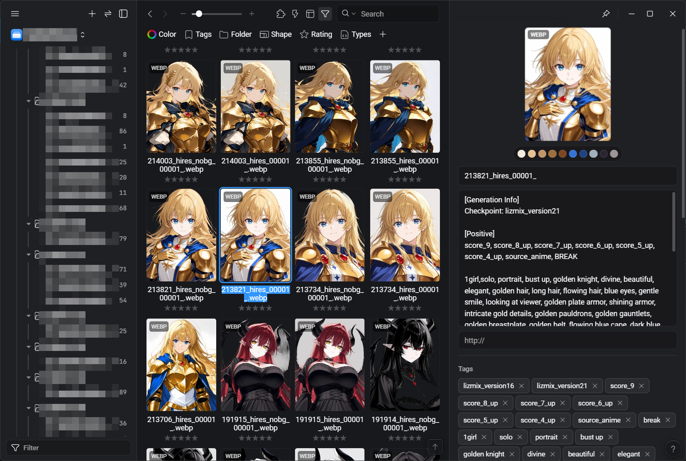
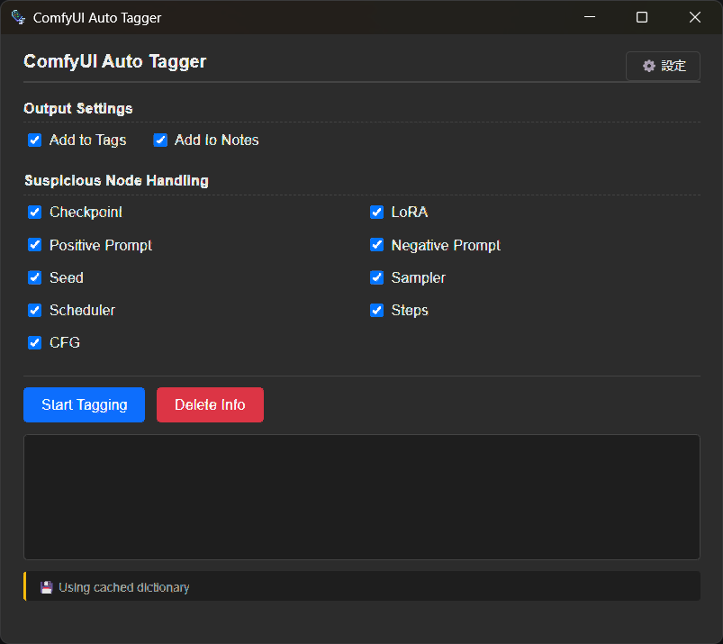

# ComfyUI Auto Tagger for Eagle

  

[English](#english) | [日本語](#japanese)

## 🇬🇧 English

**ComfyUI Auto Tagger** is a plugin for [Eagle](https://en.eagle.cool/) that automatically extracts metadata (Workflow/Prompt JSON) from images generated by ComfyUI and saves them as Eagle **Tags** and **Notes**.

It supports both **PNG** and **WebP** formats and allows you to filter which information to import.

### ✨ Features

* **Metadata Extraction**: Automatically detects and imports:
    * Checkpoint Name
    * LoRA Name
    * Positive / Negative Prompts
    * Generation Parameters (Seed, Steps, CFG, Sampler)
* **Flexible Output**:
    * **Tags**: Add extracted info to Eagle tags (e.g., `#checkpoint_name`, `#lora_name`, `seed:12345`).
    * **Notes (Annotation)**: Save full prompts and parameters in the Note section for easy copying.
* **Selective Import**: Toggle specific items (e.g., "Import Checkpoint but ignore Seed") via checkboxes.
* **Batch Processing**: Efficiently process multiple images with a progress bar.
* **Utility**: Includes a "Delete Info" button to remove tags/notes added by this plugin.

### 📸 Screenshots

  

| Output Result | Settings UI |
| :---: | :---: |
|  |  |

### 📦 Installation

1.  Download the latest `.eagleplugin` file from the [Releases page](https://github.com/NNNebel/comfyui-auto-tagger/releases).
2.  Launch Eagle.
3.  Drag and drop the `.eagleplugin` file into the Eagle window.
4.  Restart Eagle if prompted.

### 🚀 Usage

1.  Select one or more ComfyUI-generated images in Eagle.
2.  Right-click and select **"Plugins"** > **"ComfyUI Auto Tagger"**.
3.  In the popup window:
    * **Output Settings**: Choose whether to add to "Tags", "Notes", or both.
    * **Target**: Check the metadata items you want to extract (Checkpoint, LoRA, Prompt, etc.).
4.  Click **"Start Tagging"**.

### 🛠️ Development

This plugin parses `tEXt` chunks (PNG) and `EXIF/XMP` data (WebP) to retrieve ComfyUI workflows without external dependencies.
* **Debug Mode**: Enable the checkbox in the top-right corner to view detailed logs.

### ⚠️ Disclaimer & Bug Reports

*   **Disclaimer**: ComfyUI workflows can be extremely complex. 100% compatibility is not guaranteed. This plugin operates on the logic: **"Seed/Sampler is Base-first, Prompt is all-merged"**.
*   **Bug Reports**: When reporting issues on GitHub, please always attach:
    1.  Information about your generation environment (ComfyUI version, custom nodes used).
    2.  The original image (PNG/WebP) that retains its metadata.

### 📄 License

This project is licensed under the [MIT License](LICENSE).

---

## 🇯🇵 日本語

**ComfyUI Auto Tagger** は、画像収集管理ソフト [Eagle](https://jp.eagle.cool/) 用のプラグインです。
ComfyUIで生成された画像（PNG/WebP）に含まれるメタデータ（Workflow/Prompt）を解析し、モデル名やプロンプトなどを自動でEagleの「タグ」や「メモ」に追加します。

### ⚠️ 免責事項・不具合報告

*   **免責事項**: ComfyUIのWorkflowは非常に複雑なため、100%の動作は保証できません。「SeedはBase優先、Promptは全マージ」という仕様で動作します。
*   **不具合報告**: GitHubのIssueで報告する際は、以下の2点を必ず添付してください。
    1.  生成環境の情報（ComfyUIのバージョン、使用しているカスタムノード等）。
    2.  メタデータが保持された画像の実ファイル（PNG/WebP）。

### 📄 ライセンス

本プラグインは [MIT License](LICENSE) のもとで公開されています。商用・非商用を問わず、自由にご利用・改変いただけます。