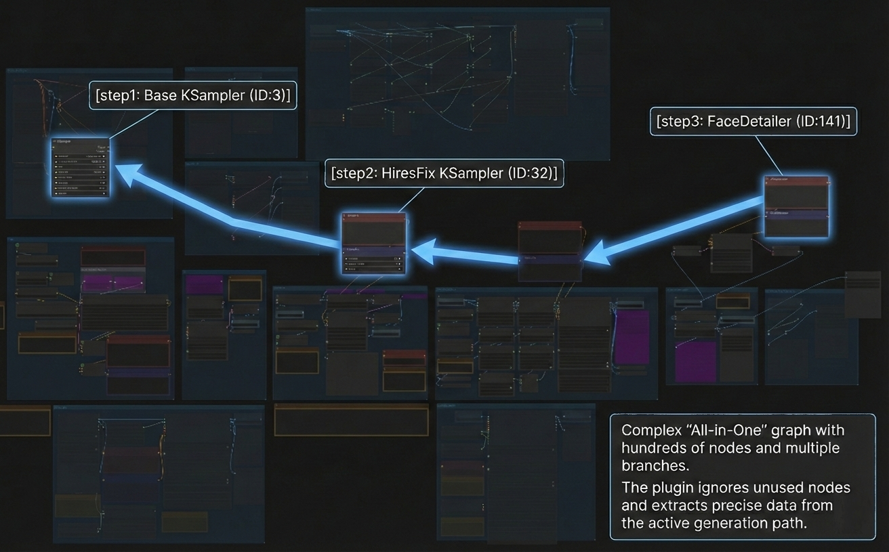
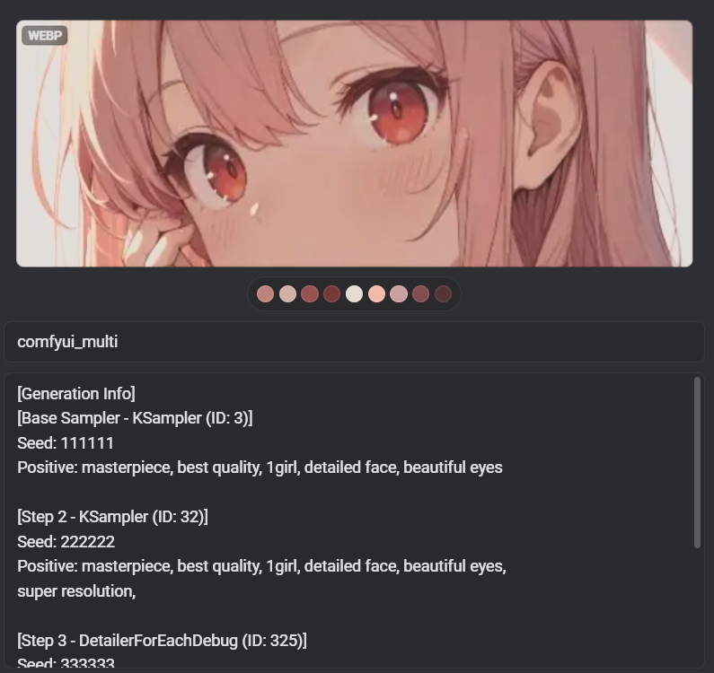
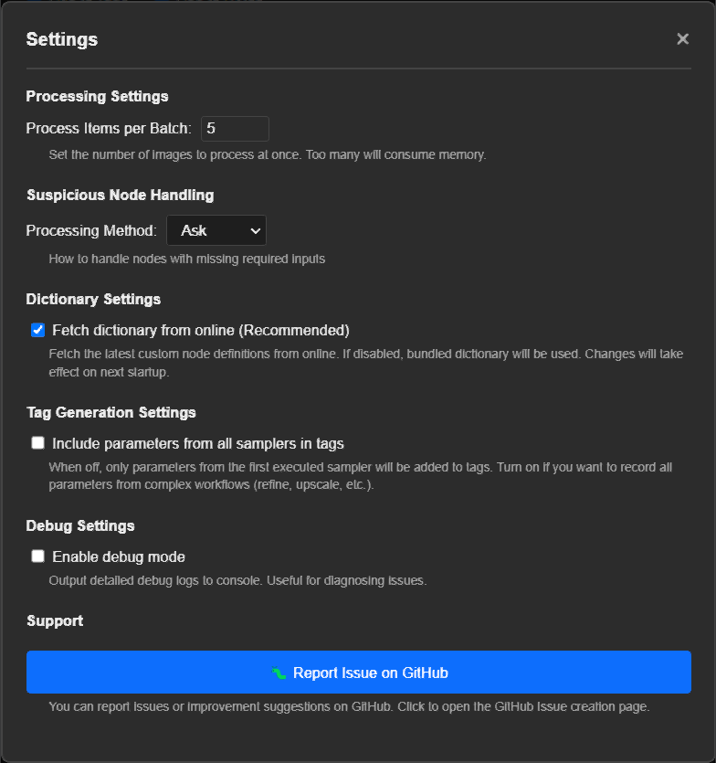

# ComfyUI Auto Tagger for Eagle

  

[English](#english) | [日本語](#japanese)

## 🇬🇧 English

**ComfyUI Auto Tagger** is a plugin for [Eagle](https://en.eagle.cool/) that automatically extracts metadata from AI-generated images. It provides two main features:

1. **Generation Info Inspector** — Instantly view prompts, seeds, and generation parameters when you select an image (with copy buttons for quick reuse)
2. **Auto-Tagging** — Save extracted metadata as Tags and Notes for organization and filtering

It supports **ComfyUI**, **Stable Diffusion WebUI** (including Automatic1111, Forge, and other variants; referred to as "A1111" below), and **Civitai** generated images in **PNG**, **WebP**, and **JPEG** formats, and allows you to filter which information to import.

> ### 🔗 Better together: Eagle Metadata Bridge
>
> [Eagle Metadata Bridge](https://github.com/NNNebel/eagle-metadata-bridge) is a ComfyUI custom node that replaces the standard Save Image node. Every time you generate an image, it automatically:
> - Sends the image to Eagle
> - Attaches tags (checkpoint, LoRA, prompt tokens, seed, sampler…) and a structured annotation
>
> When used alongside this plugin, tag management becomes even more powerful — images arrive in Eagle already tagged, and you can re-run this plugin at any time to update, filter, or batch-process them further. The node embeds an identifier into each saved image, allowing this plugin to reliably retrieve the prompt and generation parameters by tracing the exact workflow graph instead of relying on heuristics or inference.

### ✨ Features

* **Generation Info Inspector**: When you select an image in Eagle, a panel automatically appears showing the generation metadata — prompts, seed, sampler, model, and LoRA — with a copy button for each field. Multi-sampler workflows display as tabs (Base / Step 2, etc.).
* **Multi-Format Support**: Supports ComfyUI workflows (including complex multi-sampler), A1111 (Stable Diffusion WebUI) parameters, and Civitai generation metadata.
* **Metadata Extraction**: Automatically extracts the models used (Checkpoints, LoRA), prompts, and generation settings (Seed, Sampler, Steps, CFG).
* **Flexible Output**:
    * **Tags**: Adds extracted info to Eagle tags (e.g., `#checkpoint_name`, `#lora_name`, `seed:12345`).
    * **Notes (Annotation)**: Saves full prompts and parameters in the Note section for easy reference.
* **Selective Import**: Allows toggling specific items (e.g., "Import Checkpoint but ignore Seed") via checkboxes.
* **Batch Processing**: Efficiently processes multiple images with a progress bar.
* **Advanced Workflow Analysis**: Dynamically analyzes ComfyUI workflows to trace the actual execution path. Accurately extracts parameters even from complex workflows with multiple generation stages (HiresFix, FaceDetailer, etc.).
* **Suspicious Node Detection**: Detects nodes with missing required inputs in ComfyUI workflows and allows users to decide whether to include or exclude them from metadata extraction.
* **Force Delete Mode**: Removes all tags and notes from selected items without analysis (Shift + Click on "Delete Info").
* **Debug Mode**: Detailed logs for troubleshooting (toggle via checkbox).
* **No External Dependencies**: No additional libraries required — works out of the box after installation.
* **Utility**: Provides a dedicated button to safely remove only the tags/notes added by this plugin.

### 📸 Screenshots

  

| Output Result | Main UI |
| :---: | :---: |
|  |  |

#### Generation Info Inspector

Select any AI-generated image in Eagle and the inspector panel appears automatically, showing prompts, parameters, and model info — each with a copy button. Multi-sampler workflows are split into tabs.

  

#### Advanced Workflow Analysis

The plugin traces complex ComfyUI workflows to identify the actual generation pipeline, supporting multi-stage setups with multiple samplers and refinement stages (HiresFix, FaceDetailer, etc.).

  

  

#### Suspicious Node Detection

ComfyUI metadata doesn't record the actual execution path. The plugin traces back from the final image save node to extract prompts and parameters. In this process, **nodes that weren't actually used** may be included.

For example, a workflow designed for txt2img (text-to-image) might contain img2img (image-to-image) nodes. If you used only txt2img, those img2img nodes were never executed — but the plugin cannot detect this automatically. When suspicious nodes are detected, the plugin displays a dialog, allowing you to decide whether to include or exclude them from metadata extraction.

  

You can configure how to handle suspicious nodes in the settings (see Configuration section below).

### ⚙️ Configuration

  

The plugin provides several configuration options accessible via the settings dialog (gear icon):

#### Processing Settings

* **Process Items per Batch**: Set the number of images to process at once (default: 5). Processing too many images simultaneously may consume excessive memory.

#### Suspicious Node Handling

* **Suspicious Node Handling**: Configure how to handle suspicious nodes (nodes with missing required inputs):
  * **Exclude**: Automatically exclude suspicious nodes from metadata extraction
  * **Ask**: Show a dialog for each suspicious node (recommended)
  * **Include**: Include all nodes regardless of missing inputs

#### Dictionary Settings

* **Fetch dictionary from online (Recommended)**: Fetches the latest custom node definitions from GitHub. If disabled, the bundled dictionary will be used. Changes take effect on next startup.

#### Tag Generation Settings

* **Include parameters from all samplers in tags**: When enabled, parameters from all samplers in the workflow are added to tags. When disabled (default), only parameters from the first executed sampler are added. Enable this if you want to record all parameters from complex workflows with multiple refinement stages (HiresFix, upscale, etc.).

#### Debug Settings

* **Enable debug mode**: Outputs detailed debug logs to console. Useful for diagnosing issues or reporting bugs.

#### Cache Settings

* **Do not use cache**: When enabled, the plugin will not cache metadata for images. This is useful for testing or when you want to ensure fresh metadata is always extracted. Changes take effect immediately.
* **Clear All Cache**: Permanently deletes all cached metadata files. This frees up disk space and allows you to start fresh.
* **Delete Cache (Inspector)**: When viewing an image in the Inspector panel, a delete button (🗑️) appears at the bottom. Click it to delete the cached metadata for that specific image.

Cache files are stored in `{Library Path}/.eagle/plugins/comfyui-auto-tagger/metadata-cache/` and are automatically used to speed up repeated metadata viewing.

### 🚀 Usage

1.  Select one or more AI-generated images (ComfyUI/A1111/Civitai) in Eagle
2.  Right-click and select **"Plugins"** > **"ComfyUI Auto Tagger"**
3.  In the popup window:
    * **Output Settings**: Choose to add to "Tags", "Notes", or both
    * **Target**: Check the metadata items you want to extract (Checkpoint, LoRA, Prompts, etc.)

### 📦 Installation

1.  Download the latest `.eagleplugin` file from [Releases](https://github.com/NNNebel/comfyui-auto-tagger/releases)
2.  Launch Eagle
3.  Drag and drop the `.eagleplugin` file into the Eagle window
4.  Restart Eagle if necessary

### ⚠️ Disclaimer & Bug Reports

*   **Disclaimer**: ComfyUI workflows can be extremely complex. 100% compatibility is not guaranteed. This plugin operates on advanced trace logic to identify the most relevant generation parameters.
*   **Bug Reports**: When reporting issues on GitHub, please always attach:
    1.  Information about your generation environment (ComfyUI/A1111 version, custom nodes used, etc.).
    2.  The original image (PNG/WebP/JPEG) that retains its metadata.

### 📄 License

This project is licensed under the [MIT License](LICENSE).

---

## 🇯🇵 日本語

**ComfyUI Auto Tagger** は、画像収集管理ソフト [Eagle](https://jp.eagle.cool/) 用のプラグインです。
AI生成画像のメタデータを自動抽出し、以下の2つの機能を提供します：

1. **生成情報インスペクター** — 画像を選ぶと、プロンプト・Seed・生成パラメータが自動表示されます（各フィールドにコピーボタン付き）
2. **自動タグ付け** — 抽出したメタデータをEagleの「タグ」や「メモ」として保存し、整理・検索を効率化

**ComfyUI**、**Stable Diffusion WebUI**（Automatic1111、Forge等の派生版を含む。以下「A1111」と表記）、**Civitai** で生成された **PNG**・**WebP**・**JPEG** 形式の画像に対応しており、取り込む情報を選択できます。

> ### 🔗 組み合わせるとさらに便利：Eagle Metadata Bridge
>
> [Eagle Metadata Bridge](https://github.com/NNNebel/eagle-metadata-bridge) は、ComfyUI の「Save Image」ノードを置き換えるカスタムノードです。画像を生成するたびに自動で：
> - Eagle へ画像を送信
> - タグ（チェックポイント・LoRA・プロンプトトークン・Seed・サンプラーなど）と構造化アノテーションを付与
>
> 本プラグインと組み合わせることで、タグ管理がさらに便利になります。Eagle に届いた時点で既にタグが付いており、後からいつでも本プラグインで一括処理・フィルタリング・追加編集が可能です。またノードは保存した画像に識別子を埋め込むため、本プラグインがヒューリスティックな推論に頼らず、ワークフローグラフを正確に辿ってプロンプトや各種情報を確実に取得できるようになります。

### ✨ 機能

* **生成情報インスペクター**: Eagleで画像を選択すると、プロンプト・Seed・サンプラー・モデル・LoRAなどの生成情報がパネルに自動表示されます。各フィールドにコピーボタン付き。マルチサンプラーワークフローはタブ（Base / Step 2 など）で切り替え表示。
* **複数フォーマット対応**: ComfyUIワークフロー、A1111（Stable Diffusion WebUI）、Civitai生成画像に対応。
* **メタデータ抽出**: 使用したモデル（チェックポイント・LoRA）、プロンプト、生成設定（Seed・サンプラー・ステップ数・CFG）を自動抽出。
* **柔軟な出力先**:
    * **タグ**: 抽出した情報をEagleのタグとして追加（例: `#checkpoint_name`, `seed:12345`）。
    * **メモ（アノテーション）**: プロンプトやパラメータの詳細をメモ欄に保存し、参照・コピーを容易に。
* **選択的取り込み**: チェックボックスで必要な情報のみ（例: チェックポイントのみ）を選択して取り込み可能。
* **バッチ処理**: 複数画像をまとめて効率的に処理し、進捗状況を表示。
* **高度なワークフロー解析**: ComfyUIのワークフローを動的に解析し、実際の実行ルートを特定。HiresFix、FaceDetailer等、複数回に渡って画像生成を行う複雑なワークフローからも正確にパラメータを抽出。
    * 複雑なノード接続を追跡して実際の生成パイプラインを特定
    * 複数のサンプラーと改善ステージを持つマルチステージワークフローに対応
* **疑わしいノード検出**: ComfyUIのメタデータには実際の実行経路が記録されないため、プラグインは入力の欠落などから「実行されなかった未使用ノード」を推測します。しかし、未知のカスタムノードを誤って除外しないよう、検知時はダイアログを表示し、抽出情報に含めるか除外するかの判断をユーザーに委ねます。
* **強制削除モード**: Shiftキーを押しながら削除ボタンをクリックすることで、解析を行わずにタグ・メモを一括削除。
* **デバッグモード**: 詳細なログを表示してトラブルシューティングを支援（チェックボックスで切替）。
* **外部依存なし**: インストール後すぐ使えます。追加ライブラリは不要です。
* **ユーティリティ**: このプラグインが生成したタグやメモのみを安全に削除する機能を提供。

### 📸 スクリーンショット

  

| 出力結果 | メイン画面 |
| :---: | :---: |
|  |  |

#### 生成情報インスペクター

Eagleで画像を選択するとインスペクターパネルが自動表示され、プロンプト・パラメータ・モデル情報を確認できます。各フィールドにはコピーボタンが付いており、マルチサンプラーワークフローはタブで切り替えられます。

  

#### 高度なワークフロー解析

複雑なComfyUIワークフローを追跡して実際の生成パイプラインを特定します。複数のサンプラーや改善ステージを持つマルチステージ構成（HiresFix、FaceDetailer等）にも対応しています。

  

  

#### 疑わしいノード検出

ComfyUIのメタデータには実行経路が記録されていないため、プラグインは最終的な画像保存ノードから逆算してプロンプトやパラメータを取得します。その過程で、**実際には使われなかったノード**が含まれることがあります。

例えば、テキストから画像を生成する（txt2img）ワークフローに、画像から画像を生成する（img2img）用のノードが入っている場合、img2imgのノードは実行されていないにもかかわらず、プラグインはそれを検出できません。このような未実行ノードを「疑わしいノード」として推測し、ユーザーに判断を委ねる設計になっています。

ただし、ComfyUIには独自のカスタムノードが多数存在し、一見入力が不足していても正常に動作する場合があります。プラグインによる機械的な自動除外による情報の欠落を防ぐため、疑わしいノードを検出した際はダイアログを表示し、メタデータ抽出の対象に「含める」か「除外する」かの選択をユーザーに委ねる設計となっています。

  

### ⚙️ 設定

  

プラグインは設定ダイアログ（歯車アイコン）からアクセスできる複数の設定オプションを提供します：

#### 処理設定

* **一度に処理する数**: 一度に処理する画像の数を設定します（デフォルト: 5）。多すぎるとメモリを消費します。

#### 疑わしいノードの扱い

* **疑わしいノードの扱い**: 疑わしいノード（必須入力が欠落しているノード）の扱いを設定します：
  * **除外する**: 疑わしいノードを自動的にメタデータ抽出から除外
  * **確認する**: 各疑わしいノードについてダイアログを表示（推奨）
  * **含める**: 入力の欠落に関わらず全てのノードを含める
#### 辞書設定

* **オンラインから辞書を取得する（推奨）**: GitHubから最新のカスタムノード定義を取得します。無効にするとバンドルされた辞書を使用します。変更は次回起動時に反映されます。

#### タグ生成設定

* **全てのサンプラーのパラメータをタグに含める**: 有効にすると、ワークフロー内の全てのサンプラーのパラメータがタグに追加されます。無効（デフォルト）の場合、最初に実行されたサンプラーのパラメータのみが追加されます。複数の改善ステージ（HiresFix、アップスケールなど）を持つ複雑なワークフローの全てのパラメータを記録したい場合は有効にしてください。

#### デバッグ設定

* **デバッグモードを有効にする**: 詳細なデバッグログをコンソールに出力します。問題の診断やバグ報告に役立ちます。

#### キャッシュ設定

* **キャッシュを使わない**: 有効にすると、プラグインは画像のメタデータをキャッシュしません。テスト時や常に新しいメタデータを取得したい場合に便利です。設定の変更は即座に反映されます。
* **🗑️ キャッシュをすべて削除**: キャッシュされたすべてのメタデータファイルを完全に削除します。ディスク容量を解放し、キャッシュをリセットしたい場合に使用します。
* **キャッシュを削除（インスペクター）**: インスペクターパネルで画像を表示すると、下部に削除ボタン（🗑️）が表示されます。クリックして、その画像のキャッシュされたメタデータのみを削除できます。

キャッシュファイルは `{ライブラリパス}/.eagle/plugins/comfyui-auto-tagger/metadata-cache/` に保存されており、メタデータ表示の高速化に自動的に使用されます。

### 🚀 使い方

1.  EagleでAI生成画像（ComfyUI/A1111/Civitai）を1つ以上選択
2.  右クリックして **「プラグイン」** > **「ComfyUI Auto Tagger」** を選択
3.  ポップアップウィンドウで:
    * **出力設定**: 「タグ」、「メモ」、または両方への追加を選択
    * **対象**: 抽出したいメタデータ項目をチェック（チェックポイント、LoRA、プロンプトなど）

### 📦 インストール

1.  [Releasesページ](https://github.com/NNNebel/comfyui-auto-tagger/releases)から最新の `.eagleplugin` ファイルをダウンロード
2.  Eagleを起動
3.  `.eagleplugin` ファイルをEagleウィンドウにドラッグ&ドロップ
4.  必要に応じてEagleを再起動

### ⚠️ 免責事項・不具合報告

*   **免責事項**: ComfyUIのWorkflowは非常に複雑なため、100%の動作は保証できません。本プラグインは、高度な解析ロジックに基づいて最も関連性の高い生成パラメータを特定します。
*   **不具合報告**: GitHubのIssueで報告する際は、以下の2点を必ず添付してください。
    1.  生成環境の情報（ComfyUI/A1111のバージョン、使用しているカスタムノード等）
    2.  メタデータが保持された画像の実ファイル（PNG/WebP/JPEG）

### 📄 ライセンス

本プラグインは [MIT License](LICENSE) のもとで公開されています。商用・非商用を問わず、自由にご利用・改変いただけます。
